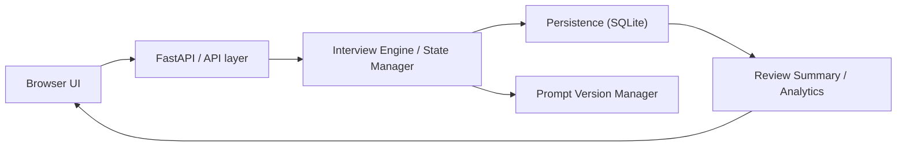
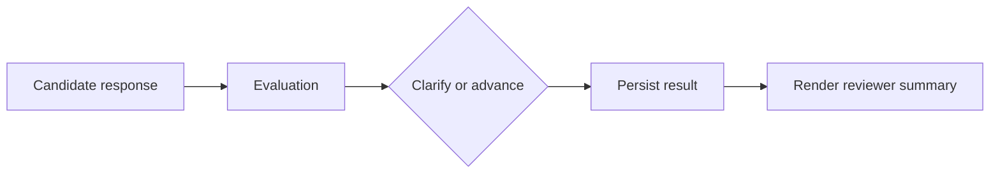

# Architecture At A Glance

## System shape

## Runtime flow

## Notes

- The API layer exposes session, feedback, comparison, and prompt-version endpoints.
- The interview engine owns explicit `asking`, `clarifying`, and `completed` state transitions.
- SQLite stores transcript turns, evaluation summary metadata, reviewer feedback, and prompt-version linkage.
- Prompt mutation is admin-gated; prompt version visibility stays read-only in the public UI.
